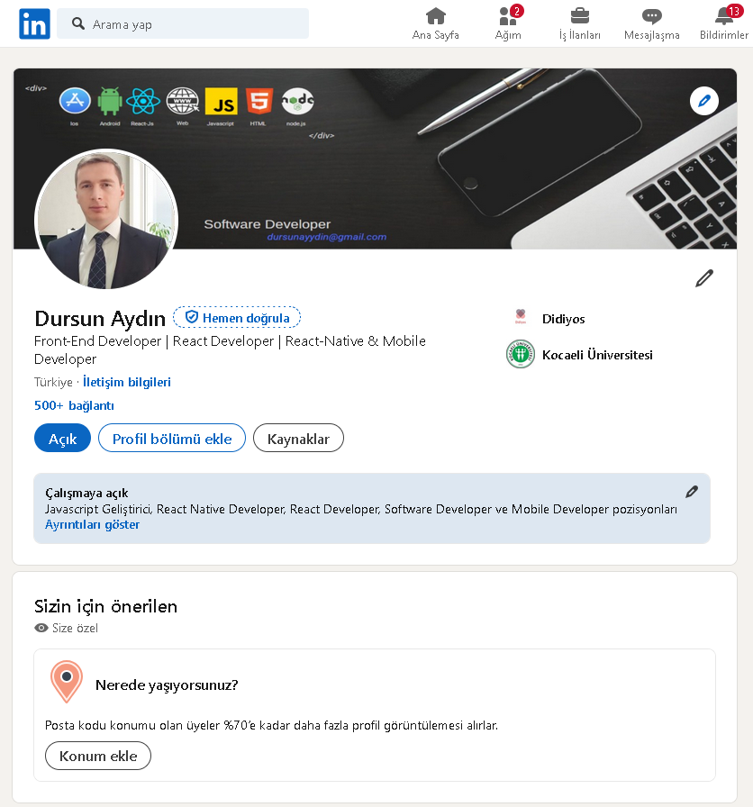

# LinkedIn Clone Projesi

Bu proje, bir LinkedIn klonu olarak tasarlanmış bir sosyal medya uygulamasıdır. Kullanıcılar profillerini oluşturabilir, bağlantılar kurabilir ve içerik paylaşabilir.

## Kullanılan Teknolojiler

- **Frontend:**

  - React
  - Vite
  - React Router Dom
  - DaisyUI
  - Tailwind CSS
  - Axios
  - React Query
  - Date-Fns

- **Backend:**
  - Node.js
  - Express
  - MongoDB (Mongoose ile)
  - JSON Web Token (JWT)
  - Cloudinary (resim yükleme için)
  - Nodemailer (e-posta göndermek için)

## Canlı Deneyim

[Canlı Deneyimi Görüntüle](https://linkedin-clone-fullstack.onrender.com)

## Proje Kurulumu

### 1. Depoyu Klonlayın

git clone <depo_url>
cd linkedinClone

### 2. Backend Bağımlılıklarını Yükleyin

npm install

### 3. Frontend Bağımlılıklarını Yükleyin

npm install --prefix frontend

### 4. Ortam Değişkenlerini Ayarlayın

MONGODB_URI=your_mongodb_uri
JWT_SECRET=your_jwt_secret
CLOUDINARY_URL=your_cloudinary_url

### 5. Uygulamayı Çalıştırın

npm run dev

## Proje Yapısı

- `frontend/`: Uygulamanın frontend kodları.
- `backend/`: Uygulamanın backend kodları.
- `package.json`: Projenin bağımlılıkları ve komutları.
- `.env`: Ortam değişkenleri için yapılandırma dosyası.

## Kullanıcı Arayüzü Özellikleri

- Kullanıcı kaydı ve giriş
- Profil oluşturma ve düzenleme
- Bağlantı kurma
- İçerik paylaşma
- Kullanıcıların birbirini takip etmesi
- Bildirim sistemi

## Projeye Ait Resimler

